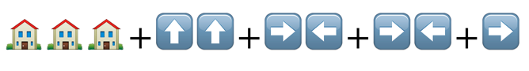

# Tubi Roku Channel

[](https://travis-ci.com/adRise/project-total-recall)

## Production Channel


Roku Channel Store: [channelstore.roku.com/details/41468/tubi](https://channelstore.roku.com/details/41468/tubi)

Direct Install: [my.roku.com/add/tubitv](https://my.roku.com/add/tubitv)

## Staging Channel


Direct Install: [my.roku.com/add/NDDHPHK](https://my.roku.com/add/NDDHPHK)

# Getting Started

1\. Clone repo:

```shell
git clone git@github.com:adRise/project-total-recall.git
```

2\. Install Node (and npm)
https://nodejs.org/en/

3\. Install NPX

```shell
npm install -g npx
```

4\. Install Gulp CLI

```shell
npm install -g gulp-cli
```

5\. Navigate to the project-total-recall directory

```shell
cd project-total-recall
```

6\. Install build libraries from npm (make sure node > 4.x is installed)

```shell
npm install
```

7\. Enable developer mode on the Roku device remote control:




When asked to set up a dev password, use "1234" so it's easier for any developer to easily know the password for any device.

8\. Set the developer id on your Roku device. (You will need to get a pkg, password, and developer id from the shared secret "Roku Rekey Info" in LastPass).

* Navigate to the Roku device's IP in your browser; select Utilities. Take note of the IP address for step #6 when you will set the "ROKU_DEV_TARGET".
* Upload the pkg file and enter the password and select `Rekey`. (This password will be used in step #6 to set "PKG_PASSWORD").
* Check that you have the proper developer ID by navigating in your web browser to the Roku device's IP and then select Packager.

9\.Create a Github Personal Access Token (this access token will be set as an environment variable in step #6):

  - Follow the instructions at https://docs.github.com/en/free-pro-team@latest/github/authenticating-to-github/creating-a-personal-access-token
  - Only select the "repo" scope and "repo" sub scopes.
  - Copy the token, as you will not be able to see it again once you leave the page.

10\. Set the build environment. Add the following environment variables to the appropriate shell configuration file:

- .zprofile for ZSH (ZSH is the default shell for new Macs.)
- .bash_profile for BASH on Macs
- .bashrc for BASH on Linux
(It might need a restart to take effect.)

```shell
export ROKU_DEV_TARGET="<your-roku-ip>""
export DEV_PASSWORD="<dev password set up on Roku device>"
export PKG_PASSWORD="<password from the GENKEY utility used for signing packages>"
export CDN_GIT_DIRECTORY="<path to the adrise_cdn repo directory ex: ~/dev/adrise_cdn>"
export GITHUB_PAT="<github personal access token>"
export ROKU_DEV_TELNET="sametab" (optional)
export AWS_PROFILE=main-roku-dev
```

11\. Create a `dev.yml` file in your `config` directory. Use the existing `dev.yml.example` file as a template.

-----

# Build

Make a development build, sideload to the device, and attach to the developer console

```shell
gulp install
```

## Using Gulp

To see a list of gulp commands `$ gulp --tasks`

__The most commonly used Gulp commands__

* `$ gulp install` - build a zip and side load it to a device (as set by your ROKU_DEV_TARGET)
* `$ gulp stage` - bumps the revision number, build a zip using the "staging" config and upload starter components, and remote components to the staging CDN.
* `$ gulp addMissingImages` - updates new_images_since file with images that need to be included in the remote component library.
* `$ gulp bumpQA` - bumps the revision number. This is used during the QA process. As changes are made and new QA builds are created, the revision number is used to distinguish between builds.
* `$ gulp release` - bump the build number, build starter and remote components .pkgs using the "production" config. This command will also make PRs to the CDN repo and this project-total-recall repo on Github.
* `$ gulp buildQaChanges` - Generates the output for the ticket that we give to QA of the changes between the current branch and the current production branch. Will automatically copy to the clipboard.
* `$ gulp buildReleaseNotes` -Generates the output for the release notes to be pasted on the release: https://github.com/adRise/project-total-recall/tags

__Gulp options__

* `--<config>` - for example `$ gulp install --staging` will build and install a zip to the targeted device using the "staging" config. There is a .yml file for each accepted config value in the /config directory.
* ``--<IP>`` - for example `$ gulp install --192.168.42.2` will build and install a zip to the device at the IP "192.168.42.2" instead of the device at "ROKU_DEV_TARGET"
* `--sametab` - for example `$ gulp install --sametab` will open the 8085 telnet port automatically in the same tab in which the gulp command was run.

## Using Visual Studio Code

To use VS Code during development we need to setup some files for it. These are included in the `.vscode.example` folder. Copy this folder and save it as `.vscode` at the root of the project. Open `.vscode/.env` and put in your Roku's IP address and password if it's different than the default.

You should now be ready to deploy to your Roku. Go to the Run and Debug tab:


You should see a launch configuration called Build & Deploy. Clicking the play button should deploy the app to your device:


You can also set a key press in your keybindings.json file to start and stop the configuration. For example in mine I have:

```json
{ "key": "cmd+r", "command": "workbench.action.debug.stop", "when": "inDebugMode"},
{ "key": "cmd+r", "command": "workbench.action.debug.start", "when": "!inDebugMode"},
```

To both deploy and stop using the same keypress

### Rendezvous Logging

While you're in the Build & Deploy tab, you'll notice there is a section labeled Rendezvous. This takes the logs output from the device when rendezvous logging is on and formats them in a more readable format.


In order to set up rendezvous logging you need to do two things. First in your `dev.yml` file you need to add the following as currently Rendezvous loggin does not work with run as process on:

```yaml
manifest:
  run_as_process: 0
```

*Note this will also disable instant resume*

Second, you need to turn on rendezvous logging. You can either do this through the telnet port 8080 or within VS Code by hitting `cmd + shift + p` and typing logrendezvous. Hit enter and you should be able to turn rendezvous logging on and off as needed.


Run the app again and you should see the rendezvouses coming in now.

### Problems Pane

If you are using vscode, it's a good idea to also check the Problems pane to look for potential issues in the applications code.


You can also filter based on type of problem, only showing results from the current file or searching for a specific pattern.

The goal is to reach 0 errors and warnings so we can start doing checks on PR reviews.

# Test

1\. Unit tests - run on a sideloaded channel using the Rooibos test framework.

For more info on setting up tests in Rooibos, please see:

https://github.com/georgejecook/rooibos/blob/master/docs/index.md#creating-test-suites

For API documentation (ie. what asserts can be run), please see:

https://georgejecook.github.io/rooibos/

To run unit tests, run the following command:

`$ gulp test`

2\. Functional / regression tests - run against staging

[github.com/stb-tester/stb-tester-test-pack-veeta](https://github.com/stb-tester/stb-tester-test-pack-veeta)

[Smoke tests](docs/tubi_tv_smoke_test.md) should be manually run for each release.

3\. If you want to provide someone (i.e. QA) a zip file of the app to [sideload](https://tubitv.atlassian.net/wiki/spaces/EC/pages/879460427/Side+Load+Roku+.zip), please see the section titled "Informal QA".

# Submission Release

Submission releases are releases that are sent to Roku.

1\. Set up the environment variables (listed in the [build step](#build)) as some of the following steps are dependent on these variables.

2\. Run unit tests locally

`$ gulp test`

Note: If you are adding a new unit test, then you can test only this new unit test. You do this by temporarily adding the "@Only" comment right before a specific unit test before running the above command.

3\. Prepare for submission release.

- Create a new branch based off of master which will be used to make updates as needed for a submission release. Branch name is not important, but for clarity it can be something like: `updates_for_x_y_submission`, where x is the Major Release number and where y is the Minor Release number: i.e. `updates_for_2_14_submission`.

- Create a new `new_images_since_x_y` file: i.e. `new_images_since_2_9` in the `new_images_since` directory.

- Update version numbers in `config/build.yml`

  - Increment `minor_version`

  - set `build_version` to `0`

- Create a new image to serve as the staging channel launch icon.
  - Using GIMP or Photoshop or other image editor, modify the `channel-store/channel-store-poster-540x405.png` with some text to identify it as the x_y staging channel.

  - Save the modified image as `channel-store/channel-store-poster-staging-540x405.png`, overwriting the old staging channel launch icon.

- Make a new PR of the `updates_for_x_y_submission` against master. Once the PR has been merged delete the branch as normal.

- Create a new branch off of master named "x_y_branch", where x is the Major Release number and where y is the Minor Release number: i.e. `2_14_branch`. Push this branch to Github. This branch will serve as the source of truth for what is in production until the next submission release.

4\. Create a staging channel for the minor build from the `x_y_branch`

- Run `$ gulp install --staging`

   You may see a Connection Error modal on roku device, it is because the starter and remote components are not yet there in aws. We will upload it to aws in coming steps. So you may ignore the error modal now. Just make sure the 'tubi_x_y_z.pkg' got created in /build directory.

- In a browser, navigate to [https://developer.roku.com/developer-channels/channels](https://developer.roku.com/developer-channels/channels), sign in, and follow the process to create a new private channel.

  - Upload the `tubi_x_y_z.pkg` file from the `/build` directory.

  - Name the channel `Staging x_y`.

  - Upload `channel-store/channel-store-poster-staging-540x405.png` as the "Channel Poster".

5\. Deploy to staging

- Before deploying to staging, ensure you have the AWS CLI tool installed. If you have not done that yet, then do that now,
[https://docs.aws.amazon.com/cli/latest/userguide/cli-chap-install.html](https://docs.aws.amazon.com/cli/latest/userguide/cli-chap-install.html)
  - Navigate to your `.aws` directory (typically found at `~/.aws`)

  - In the `config` file set the `AWS_DEFAULT_REGION`.

  ```text
  [default]
  region = us-west-1
  ```

  - In the `credentials` file, set the `AWS_ACCESS_KEY_ID` and `AWS_SECRET_ACCESS_KEY`.

  ```text
  [default]
  aws_access_key_id = <<aws_access_key_id>>
  aws_secret_access_key = <<aws_secret_access_key>>
  ```

  - Upload the starter components and remote components onto the staging AWS server, run:

    `$ gulp stage`

6\. Run functional tests against staging

```shell
TBD
```

7\. Create a SC ticket with any changes that have been made and give the ticket to the QA team for manual testing.

  - Go to the ShortCut tool
  - Create a QA ticket by navigating to the following menu items: Create Story in Team> Create Story> Product QA Team> Roku QA Template
  - Run the command gulp buildQaChanges, which will build most of the copy for this ticket and place it in your clipboard
  - Paste the copy in the newly created SC ticket from the previous step
  - Make sure that no work is missing in the list and that the included info looks correct
  - Provide QA with a link to the ticket within the roku_qa slack channel

8\. Any bugs found by QA should be fixed, committed to master, and then cherry picked into this QA branch and update private channel.

  - Run `$ gulp install --staging`

  - In a browser, navigate to [https://developer.roku.com/developer-channels/channels](https://developer.roku.com/developer-channels/channels), sign in, and find the private channel you just created in step 4.

  - Upload the `tubi_x_y_z.pkg` file from the `/build` directory.

  - Upload the starter components and remote components onto the staging AWS server, run:

    `$ gulp stage`

9\. After QA Sign Off, run `$ gulp release`. This will:

  - increment the version number once more (the QA build should not be the same version number as the production build)
  - install a new build using the "production" config, to create the .pkgs needed to update the production build.
  - rename the current branch to `release_x_y_z`.
  - copy the tubi_starter_components_x_y_z.pkg and tubi_remote_components_x_y_z.pkg files to the local CDN repo.
  - update the local CDN repo by doing the following:
    - checking out master
    - pulling master from origin
    - creating a new branch called `roku_x_y_z`
  - push the `roku_x_y_z` branch to origin
  - make a PR against `master` from the `roku_x_y_z` branch.
  - push the `release_x_y_z` branch to Github.
  - make a PR to the `x_y_branch` on Github from the `release_x_y_z` branch.
  - prompt you to make a Github release (including adding build notes) in the CLI based on the tag that was just created. __If you choose not to make a release in the CLI, you must do step 14.__
    - Automatic release note generation has now been added. If you choose not to use the automatically generated release notes, please make sure that the release notes adhere to the following. Each build note should be correspond to a change that was submitted as part of the QA Shortcut ticket that you made earlier. Remember, do not use commit messages, but rather write simple phrases or sentences that are easy to digest and accurately describe what the change was. Assume non technical readers will be consuming this information.
  - copy the Github urls for the two PRs made above to the clipboard.

    __Note:__ As an edge case, if you need to manually perform the release steps for the new build, follow the [Manual Submission Release Steps](https://github.com/adRise/project-total-recall/docs/manual_release.md#submission-release)

10\. Inform the team that the PRs are ready for review (you can paste the urls that were added to the clipboard when the last step completed, into the `#roku_dev slack channel`. The PR URLs can also be found on the project-total-recall and adrise_cdn repos respectively), and wait for approval.

11\. Merge the new PR in the adrise_cdn repo. Also merge the release_x_y_z PR into the x_y_branch branch. Once merged, delete both of these branches.

12\. check if you need to tun multifactor authentication for AWS. Typically this means running `$ vauth`. Refer to the [valet repo](https://github.com/adRise/valet#installation) on how to install the vauth command.

- __DO NOT PROCEED TO THE FOLLOWING INFRA SCRIPT STEP UNTIL THE PR FOR THE adRise_cdn REPO AND THE PR FOR THE project-total-recall REPO ARE APPROVED AND MERGED.__

13\. Use an infra script to move the updates from the CDN repo to the actual CDN servers.

- Ensure you have the latest files. Update your local version of the [adrise_infrastructure repo](https://github.com/adRise/adrise_infrastructure)
- You may find during this step, that you may not have the correct version of python. If that is the case, then you will need to update your version on python based on your system requirmements. If you are on Mac, you may simply have to run the following command within your adrise_infrastructure repo:

  `$ pyenv`

- If you still need to setup Infra, then in terminal, navigate to your adrise_infrastructure repo and run the setup instructions that are found on the infrastructure repo's [README file](https://github.com/adRise/adrise_infrastructure#setup)
- Deploy to the CDN by running the Infra script which is detailed on the [CDN README file](https://github.com/adRise/adrise_cdn/#deploy-to-aws-s3).

14\. Submit build to Roku

- In a browser, visit [https://developer.roku.com/developer-channels/channels](https://developer.roku.com/developer-channels/channels), sign in, and follow the process to update the "Tubi - Free Movies & TV" channel with the `/build/roku_x_y_z.pkg` file.

15\. Email Roku Partner Success to let them know the build is in their queue.

16\. Push the tag corresponding to the build that was just pushed to Github `$ git push origin x_y_z`

17\. Once the channel update has been released by Roku, create a release on Github

- From the following link, find the tag that was just pushed to Github, and click on the link for that tag.
  - [github.com/adRise/project-total-recall/tags](https://github.com/adRise/project-total-recall/tags)

- Select "Edit Tag"
- If you made a pre-release as part of step #7, uncheck the "This is a pre-release" box and then select "Update Release". You can skip the other sub steps of step #12.
- Update the "Release Title" to be either "Submission Release" or "Remote Release" depending on the type of release.

- In the description area, add the date on which the release was actually deployed (ideally this is the same day as the Github release is being created, but sometimes it might not be.

- Also within the description area, add the changes that were included in the release to the "Describe this release" description text box if you did not use the automatic release note generation. As it was mentioned earlier, use the the changes that were submitted to the QA Shortcut ticket that you made earlier. Each change should be on its own line and end with a period. Remember do not use commit messages, but rather write simple phrases or sentences that are easy to digest and accurately describe what the change was. Assume non technical readers will be consuming this information.

- Select "Publish Release"

# Remote Release

Remote releases are releases that are not sent to Roku, and updates are made when a device loads the Tubi channel, by downloading the starter component and remote component files, which are used to build the channel UI.

1\. Set up the environment variables (listed in the [build step](#build)) if not done already, as some of the following steps are dependent on these variables.

2\. Checkout the most recent `x_y_branch` branch. Create a new branch off of the `x_y_branch` called something like `qa_x_y_z`, where x is the Major Release number, where y is the Minor Release number, and where "z" is the patch number.

3\. Run `$ gulp compareProd`. This will do the following:

  - fetch any commits from remote `master` to local `master`
  - fetch any commits from the most recent remote `x_y_branch` to the local `x_y_branch`.
  - Compare the last 200 commits on local `master` with the last 200 commits on the local `x_y_branch`, and print out a list of commits that exist on local `master` but have not yet been cherry picked to the local `x_y_branch`.

__NOTE__ you can also use the new `gulp compareCheckedOut` after the initial qa branch for a release has been made to see a list of PRs that have not been cherry picked into the current qa branch.

4\. Cherry pick any commits from local `master` that are to be included in the next release onto the qa branch `qa_x_y_z`.
(See [this page](https://www.previousnext.com.au/blog/intro-cherry-picking-git) for more info info on the cherry pick git command.)

Ensure the cherry pick commit names include the name of PR number. This usually is done automatically but be aware that we need to have the PR numbers to make it easier later on so we know which PRs have been pushed and which ones have not.

5\. Run the command `gulp addMissingImages` to update the `new_images_since/new_images_since_x_y` file with any new or updated images.

6\. Make a new commit on the `qa_x_y_z` branch with the hotpatch and new images updates. Push `qa_x_y_z` branch to github.

7\. Run `$ gulp bump` in order to increment the version number.

8\. Deploy to staging

- Before deploying to staging, ensure you have the AWS CLI tool installed. If you have not done that yet, then do that now, [https://docs.aws.amazon.com/cli/latest/userguide/cli-chap-install.html](https://docs.aws.amazon.com/cli/latest/userguide/cli-chap-install.html)

  - Navigate to your `.aws` directory (typically found at `~/.aws`)

  - In the `config` file set the `AWS_DEFAULT_REGION`.

  ```text
  [default]
  region = us-west-1
  ```

  - In the `credentials` file, set the `AWS_ACCESS_KEY_ID` and `AWS_SECRET_ACCESS_KEY`.

  ```text
  [default]
  aws_access_key_id = <<aws_access_key_id>>
  aws_secret_access_key = <<aws_secret_access_key>>
  ```

- Run multifactor authentication for AWS. Typically this means running `$ vauth`. Refer to the [valet repo](https://github.com/adRise/valet#installation) on how to install the vauth command.
- Upload the starter components and remote components onto the staging AWS server, run:

  `$ gulp stage`

  Note: This will also push the current qa branch to github.

9\. Create a SC ticket with any changes that have been made and give the ticket to the QA team for manual testing.
  - Go to the [ShortCut tool](https://app.shortcut.com/tubi/team/61525f46-2903-4bfc-afa4-83f9d7fefbfb?stories_sort_by=priority&stories_group_by=workflow_state_id)
  - Create a QA ticket by navigating to the following menu items: Create Story in Team> Create Story> Product QA Team> Roku QA Template
  - Run the command `gulp buildQaChanges`, which will build most of the copy for this ticket and place it in your clipboard
  - Paste the copy in the newly created SC ticket from the previous step
  - Make sure that no work is missing in the list and that the included info looks correct
  - Provide QA with a link to the ticket within the roku_qa slack channel

10\. Any bugs found by QA should be fixed, committed to master, and then cherry picked into this QA build. Use the following command to update the staging channel with the latest version of the QA branch.

  `$ gulp stage`

  Note: The revision number will only display as part of the version number under the About Settings Screen when the mode is set to "qa".

11\. After QA Sign Off, run `$ gulp release`. This will:

  - increment the version number once more (the QA build should not be the same version number as the production build)
  - install a new build using the "production" config, to create the .pkgs needed to update the production build.
  - rename the current branch to `release_x_y_z`.
  - copy the tubi_starter_components_x_y_z.pkg and tubi_remote_components_x_y_z.pkg files to the local CDN repo.
  - update the local CDN repo by doing the following:
    - checking out master
    - pulling master from origin
    - creating a new branch called `roku_x_y_z`
  - push the `roku_x_y_z` branch to origin
  - make a PR against `master` from the `roku_x_y_z` branch.
  - push the `release_x_y_z` branch to Github.
  - make a PR to the `x_y_branch` on Github from the `release_x_y_z` branch.
  - copy the Github urls for the two PRs made above to the clipboard.
  - create a tag based on the last commit named `x_y_z`
  - push the tag to Github
  - prompt you to make a Github release (including adding build notes) in the CLI based on the tag that was just created. __If you choose not to make a release in the CLI, you must do step 14.__
    - Automatic release note generation has now been added. If you choose not to use the automatically generated release notes, please make sure that the release notes adhere to the following. Each build note should be correspond to a change that was submitted as part of the QA Shortcut ticket that you made earlier. Remember, do not use commit messages, but rather write simple phrases or sentences that are easy to digest and accurately describe what the change was. Assume non technical readers will be consuming this information.

  __Note:__ As an edge case, if you need to manually perform the release steps for the new build, follow the [Manual Remote Release Steps](https://github.com/adRise/project-total-recall/docs/manual_release.md#remote-release)

12\. Inform the team that the PRs are ready for review (you can paste the urls that were added to the clipboard when the last step completed, into the `#rokudev slack channel`. The PR URLs can also be found on the project-total-recall and adrise_cdn repos respectively), and wait for approval.

13\. Merge the new PR in the adrise_cdn repo. Also merge the release_x_y_z PR into the x_y_branch branch. Once merged, delete both of these branches.

14\. check if you need to tun multifactor authentication for AWS. Typically this means running `$ vauth`. You ran this in a previous step, but some time may has passed and you may have to run it again. Refer to the [valet repo](https://github.com/adRise/valet#installation) on how to install the vauth command.

- __DO NOT PROCEED TO THE FOLLOWING INFRA SCRIPT STEP UNTIL THIS PR AND THE PREVIOUS PRs ARE APPROVED__

15\. Use an infra script to move the updates from the CDN repo to the actual CDN servers.

- Ensure you have the latest files. Update your local version of the [adrise_infrastructure repo](https://github.com/adRise/adrise_infrastructure)
- You may find during this step, that you may not have the correct version of python. If that is the case, then you will need to update your version on python based on your system requirements. If you are on Mac, you may simply have to run the following command within your adrise_infrastructure repo:

  `$ pyenv`

- If you still need to setup Infra, then in terminal, navigate to your adrise_infrastructure repo and run the setup instructions that are found on the infrastructure repo's [README file](https://github.com/adRise/adrise_infrastructure#setup)
- Deploy to the CDN by running the Infra script which is detailed on the [CDN README file](https://github.com/adRise/adrise_cdn/#deploy-to-aws-s3).

16\. Verify the release

- Run a smoke test on production checking at minimum:
    - The production channel loads
    - Video plays
    - Ads play
- Monitor various metrics for signs of any issues:
  - [Ad impressions per second](https://app.datadoghq.com/dashboard/ckr-vrw-xh4/ad-server-business-metrics?from_ts=1563412592034&to_ts=1564017392034&live=true&tile_size=m&fullscreen_widget=80673160&fullscreen_section=overview)

17\. Create a release on Github (only if you did not create a release in the CLI as part of step 9). As part of the release script, a tag was automatically created and pushed to Github.

- From the following link, find the tag that was just pushed to Github, and click on the link for that tag.
  - [github.com/adRise/project-total-recall/tags](https://github.com/adRise/project-total-recall/tags)

- Select "Edit Tag"

- Update the "Release Title" to be either "Submission Release" or "Remote Release" depending on the type of release.

- In the description area, add the date on which the release was actually deployed (ideally this is the same day as the Github release is being created, but sometimes it might not be).

- Also within the description area, add the changes that were included in the release to the "Describe this release" description text box if you did not use the automatic release note generation. As it was mentioned earlier, use the the changes that were submitted to the QA Shortcut ticket that you made earlier. Each change should be on its own line and end with a period. Remember do not use commit messages, but rather write simple phrases or sentences that are easy to digest and accurately describe what the change was. Assume non technical readers will be consuming this information.

- Select "Publish Release"

# Informal QA

Sometimes a feature is given to the QA team before an official staging build is ready for them to test. This allows the QA team to get an early start on testing the feature and create tickets for the Roku dev team in a quicker manner. In order to create an informal QA build, use the `qa` config:

`$ gulp install --qa`

The build will have the following features:

- Write the urls of requests that are made to the 8085 telnet console.
- RAF debug output set to `true` so that RAF output is written to the 8085 debug console.
- Content APIs are set to production. Analytics ingestion API, and Logging API set to staging.
- No starter components or remote components are used.

Send the .zip that is created to the appropriate QA team member along with a Shortcut ticket requesting testing.

# Suitest

To create a build for Suitest testing, update the `qa.yml` file such that the suitest setting is set to true:

`suitest: true`

Then run:

`$ gulp install --qa`

# Experiments

We may want to see how a new feature will affect the app's metrics from a small group of our users before rolling out the feature to everyone on a given  platform. To do this, we will need to use the popper experiment system to let the app know when an experimental feature should be seen. Below are the details of this process.

## Setting up the experiment within the Popper Experiment System:

- Set up an experiment JSON file in the popper-config github repo under the namespaces > [NameSpace] > offers. Name the JSON something unique for your experiment: i.e. "roku_trailers.json". Note that we can only have one live experiment per namespace per device? So if we have 4 namespaces, then a max of 4 experiments can be seen on one device. However, in most cases, we will only need to ever have one namespace to contain all of the Roku experiments.

- Each experiment JSON file specifies the number of treatments in a given experiment. For a boolean experiment (A/B test), there will be 2 treatments: on and off ("on" and "control"). Each experiment __must have__ at least one treatment named "control". Other treatments can be named arbitrarily, but typically we use "on" for boolean experiments.

- Each experiment JSON file also specifies the resource associative array associated with each treatment. It is considered best practice to use the values in the resource associative array, rather than using the treatment name to place devices into an experiment experience. A resource associative array is a list of properties that the client code can use during the experiment: i.e. background color. Rather than placing the properties in the client code, we have the option of externalizing the properties in popper so it is easy to make changes in Popper during an experiment without touching the client code.

- Each experiment JSON file also specifies the different time phases of the experiment and when each phase ends. Typically there will be a "qa" phase and a "production" phase.

  Please note that during the "qa" phase, in a response from the Popper API, the experiment name will be prepended with the string "qa.". For example, an experiment with the name `roku_vitg` will be rendered as `qa.roku_vitg` during the qa phase.

- For more information on how to format the experiment JSON files, see the [Popper Config Github repo and its ReadMe file](https://github.com/adRise/popper-config).

## Deploying an experiment on Popper Staging:

Staging experiments are stored on the `roku_popper_staging` branch. Before adding new experiments to the roku popper staging environment, do the following:
1. Pull the remote `roku_popper_staging` branch to your local `roku_popper_staging` branch
2. Pull the remote `master` branch to your local `master` branch
3. Merge your local `master` branch into your local `roku_popper_staging` branch.

For each experiment that needs to be added to the roku popper staging environment, do the following:
1. Create a separate local branch off of master.
2. Merge your experiment branch into the `roku_popper_staging` branch.

Once all experiment branches for the release have been merged into the `roku_popper_staging` branch, then:

1. Go to https://github.com/adRise/popper-config/actions/workflows/deploy.yml. Click the `Run workflow` dropdown on the right and make sure the branch is `roku_popper_staging` and Target Popper Environment is `roku_staging`. Once confirmed, click the `Run workflow` button.
2. This should make a new Deploy workflow. Click into it. It will take some time to complete. Once it gets to the "Create Git Tag" step, look at that step's output. It should look something like:
`* [new tag]           20220525.205906Z_ea68a278 -> 20220525.205906Z_ea68a278`
In this case `20220525.205906Z_ea68a278` is our build id.

3. Connect to the VPN
4. Go to [Argo CD](https://argo.main-staging-custom.staging.k8s.tubi.io/applications/argocd/popper-engine-roku?view=network&resource=)
5.  Press the buttons "SYNC"> "SYNCHRONIZE"

If all was successful, you should be able to login to https://popper.tubi.io/ and see the experiment display under the `staging-roku` environment.

## Setting up the experiment within the Roku Code:

- Within TubiExperiments.brs, set up a default experiment resource. Although the Popper experiment system can set a default value, we should still set a default resource client-side in case the app cannot communicate to the backend. Additionally, when the experiment ends, Popper will cease to provide a resource for the experiment, so the default resource will be used as a fallback. As previously stated, the resource values provide the code a way to externalize the properties of a given experiment. Locate the defaultResources associative array within the TubiExperiments.brs file and add the default resource associative array within the appropriate namespace.
For example:

  ```vbnet
  defaultResources: {
    RokuNamespace: {
      roku_trailers: {
        background: "FF0000FF",
        delay: 5000
        on: false
      }
        }
  }
  ```

- After you have set everything up, then you can have your code check which experiment is turned on and display to the user that experiment. To do this, you simply have to add somewhere in your code (where it makes sense) a call to the getExperimentResource() method to check if an experiment has been turned on.
For example:

  ```vbnet
  if getExperimentResource("RokuNamespace", "roku_trailers").on = true
    '//Do something to turn on the experiment throughout the app
  end if
  ```

- Alternately, you can call the getExperimentResource() method to get the associative array associated with the experiment and do the appropriate things that are particular to your experiment.
For example:

  ```vbnet
  '//Set the background color based on the experiment
  properties = getExperimentResource("RokuNamespace", "roku_trailers")
  if properties.background <> invalid
    m.background.color = properties.background
  end if
  ```

By updating the default resource in Popper Config, it is possible to update all devices to a specific experiment experience without changing any client code.

## Updating the static text (translations) in app

The app stores all of its static text for various languages centrally. If you need to make a change, you should follow the below procedures.

If you need to make a change or addition to the American English text

- Create a new branch and modify the file /translations/en-US.json

- Then run the following command line within the project's root folder:

  ```shell
  gulp update_local_translations
  ```

  This will modify the TubiLanguageTranslate.brs to include the new English text

- Once your branch has been merged into master, then run the following command line within the project's root folder to upload your approved changes to the Crowdin server. "KEY" is the key used for our Crowdin account.

  ```shell
  gulp upload_translations --crowdinKey "KEY"
  ```

  This upload command will do two things:
  - Modify the TubiLanguageTranslate.brs to include the new English text (just in case you skipped the previous step).

  - Upload the new change to the Crowdin server so the change can be recorded and our translators can work on obtaining translations for the new change.

If you need to make a change to text that is not the default English, then log into [Crowdin](https://crowdin.com/project/tubiapps) and adjust the translation. Then you will need to follow the directions on how to update the app with the latest translations. Better yet, create a ticket for the translation team to update the translaton. More details can be found at https://www.notion.so/tubi/Localization-d5007e6666d1436bac4391acef5c73bf

If you need to get the latest translations from the Crowdin servers, then create a new GIT branch and run the below command line within the project's root folder, where "KEY" is the key used for our Crowdin account. This will modify the TubiLanguageTranslate.brs to contain all the translations available within Crowdin. You later need to create a PR to start the process of getting the new translations merged to the master branch.

  ```shell
  gulp download_translations --crowdinKey "KEY"
  ```

NOTE: Instead of passing the crowdin key, you can set the crowdin key as system environment variable labeled as"ROKU_CROWDIN_KEY". This is actually the preferred way of doing things. Check your system on how to create an environment variable. Also note, that the Crowdin key can be gotten either from the company's LastPass Account or through the [Crowdin website](https://crowdin.com/project/tubiapps/settings#api).

After some time of features being added/removed, some translations may no longer be needed. The following command line script should be used to check for any unnecessary translations. A PR should then be created to remove these no longer-needed translations. Please note that the script also displays other potentially unnecessary things in the codebase: i.e. images.

  ```shell
  gulp codeClean
  ```

# Restart Github Action Runner

A linux machine has been dedicated in the San Francisco office to be used for GitHub PR unit testing. A Github Actions runner is running on this linux machine.  A roku device is connected to the linux machine.

When any PR is raised against master, the Github Actions runner triggers all of the project's unit tests. The PR will be allowed to merge based on the runner's test results.

If the Github Actions runner is not working, the linux machine may need to be restarted. The below document explains how to do that.
https://tubitv.atlassian.net/wiki/spaces/IT/pages/2465464321/Accessing+Roku+Github+Action+Server

# Charles Proxy

Roku app integration with Charles proxy.

## Requirements:

--   Both  the computer and the Roku need to be on the same network.
-- Charles installed (https://www.charlesproxy.com/download/)

## Charles Setup:

--   In the docs folder there is file called [CharlesRewrites.xml](https://github.com/adRise/project-total-recall/blob/master/docs/CharlesRewrites.xml).  This file is used to import the required rewrites into Charles.

### Rewrite

Open the Charles and make a note of local ip address (help->local ip address)

Then go to Tools > Rewrite > Import. From here navigate to the project root and open the  [CharlesRewrites.xml](/docs/CharlesRewrites.xml)

IMP: Now Click on each rewrite rule and change the ip address(192.168.68.57) to local ip address noted above.  

(It is also worth noting that if you have changed the port Charles is running on you will need to update the `8888` value to what ever you have configured in Charles.)

### Settings

 Go to Proxy > Proxy Settings and in the  `HTTP Proxy`  area you will need to turn on the following:

- `Enable transparent HTTP proxying`

## Roku Setup

Now that Charles is setup and ready to receive requests from your Roku , please insert following in your dev.yml

```yaml
charlesProxyUrl: "http://{{localHostAddress}}:8888"
charlesProxyEnabled: true
```

If set up correctly the first time your Roku sends a request to Charles, Charles will ask you to approve the connection. Just click `Allow` and you should see the traffic in Charles(except Youbora and Santry related traffic).

# 11.0 Unused Variables

The spring 2022 11.0 firmware release introduced checking for unused local variables inside of functions. While it is best to remove variables if they're not needed, there are times where this is not the simplest thing to do, especially if there are plans to add more functionality to the function in the future. Roku provides a way to silence these warnings by prepending your variables names with an underscore `_` character. Without this logs like the following will show up in the debug console

```text
BRIGHTSCRIPT: WARNING: unused variable 'port' in function 'processmessage' in pkg:/components/tasks/VideoMonitoringTasks/Youbora/YBPluginRokuVideo.brs(127)`
```

When you see these go ahead and either remove the variable or add a leading underscore to silence them to avoid clogging up the debug console.

# Contributing

See [CONTRIBUTING.md](CONTRIBUTING.md)

## PR Reviews

Please see [Roku PR Review Considerations](https://docs.google.com/spreadsheets/d/12cwrRYG2EAShU0YJV_xyaTPWGPZUIA0ySYbUm2NqmcA/edit#gid=0) for ideas about what to consider while doing PRs. Please note, these are minimum considerations and not intended to be an exhaustive check list for doing pR reviews.


Last updated by: Brian Leighty
