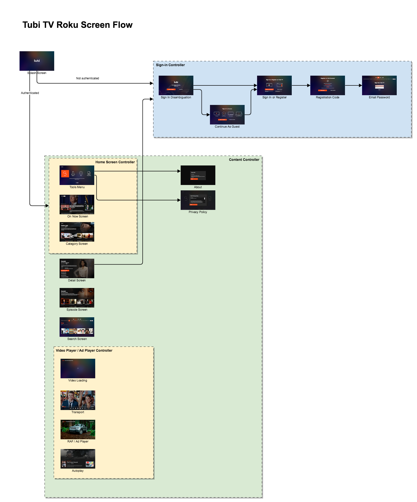
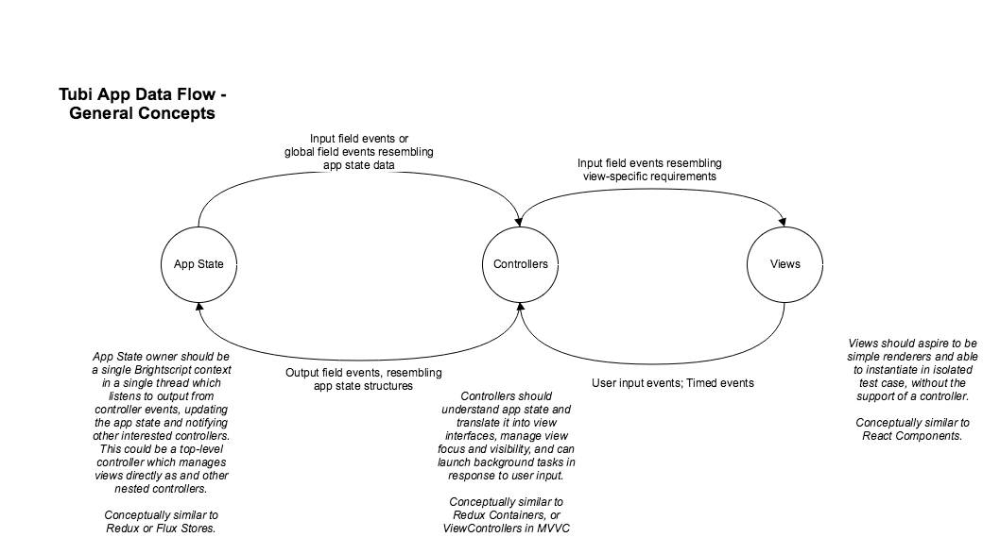
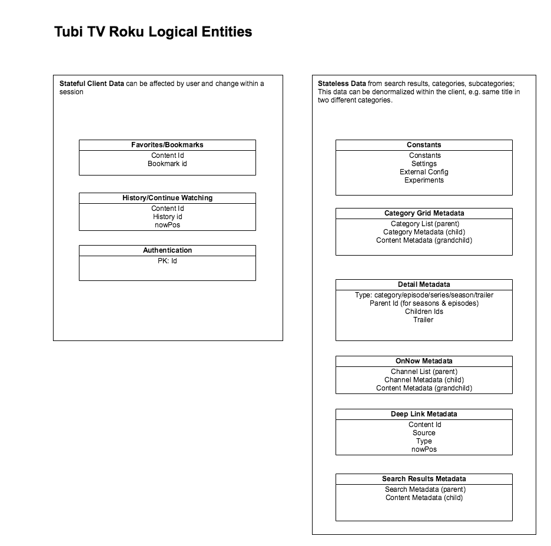
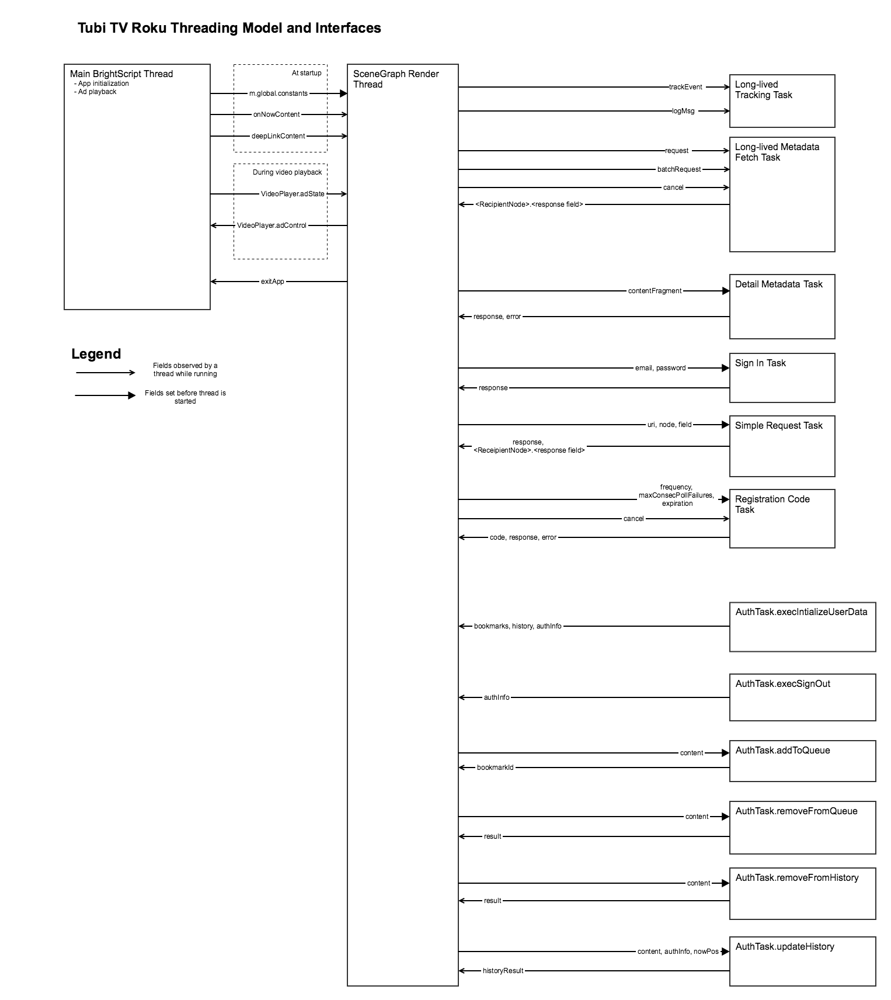

# Tubi TV Roku Channel Architecture

**Table of Contents**

* [High-level Requirements / Features](#high-level-requirements--features)
    * [Functional Requirements](#functional-requirements)
    * [Visual Requirements](#visual-requirements)
    * [Operational Requirements](#operational-requirements)
* [Technical Design](#technical-design)
    * [Screen Flow](#screen-flow)
    * [Threading Model](#threading-model)
    * [Data Model](#data-model)
* [Source Layout](#source-layout)
* [Reference](#reference-1)

-----

## High-level Requirements / Features

### Functional Requirements

1. VOD Navigation & Selection
    1. Bookmarking
    1. History tracking
    1. Searching
1. Video playback
    1. Ad breaks
    1. Seeking
    1. Captions
    1. Autoplay
    1. Resuming
1. Deep linking
    1. from Roku device Search
    1. from Roku ios Search
    1. from Tubi ios
1. User authentication
    1. Via registration code or email & password
    1. Persisted across channel launches
1. On Now / Live Experience

### Visual Requirements

1. [UI/UX Designs in Zeplin](https://app.zeplin.io/project/58f4f7a1e2016bb75497b3b1/dashboard)
1. Target resolution FHD 1080p, scaled for HD & SD devices

### Operational Requirements

1. Makefile-driven build system with node support
1. Unit tests
1. Hotpatch support (live code changes outside of channel publishing path)
1. Global Constants/Settings/Feature flags
1. User event tracking

## Technical Design

### Screen Flow

### Data Model

### Threading Model

## Source Layout

| Path | Usage |
| ---- | ----- |
| Makefile| Main project Makefile.  This builds and install the channel |
| /build | build output goes here.  This is not checked in to git. |
| /config | Run-time environment settings for the channel. |
| /docs | Supplemental documentation for the channel |
| /spec | Black box tests for the channel |
| /src/hotpatch | Hotpatch template files |
| /src/channel | Channel sources and assets which will be included in the channel package and remote components |
| /src/channel/source/tests | Unit tests |
| /tools | These are build-time tools based on node.  They are launched from the Makefile. |
