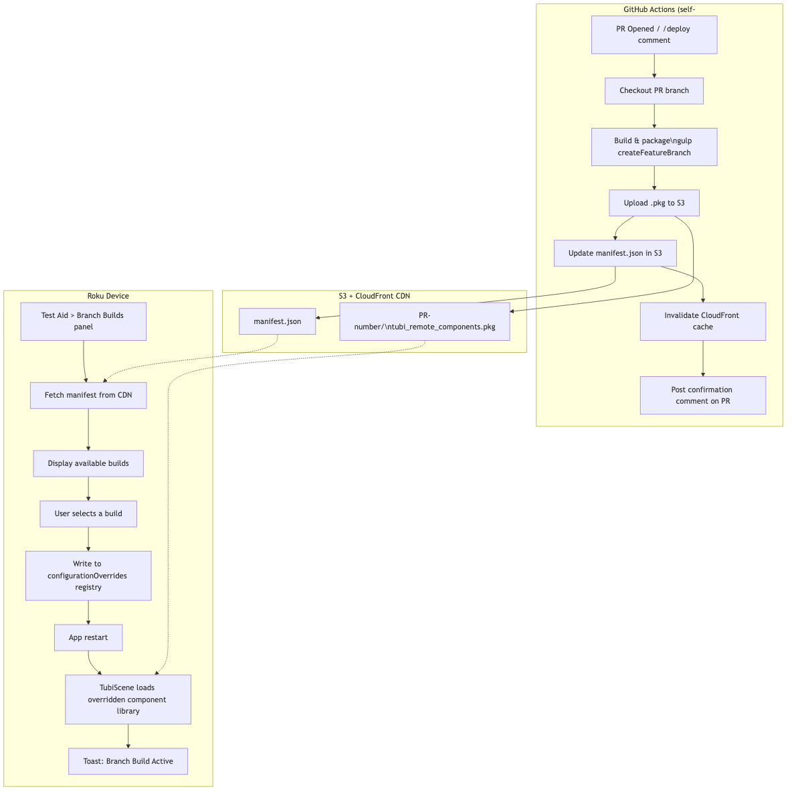
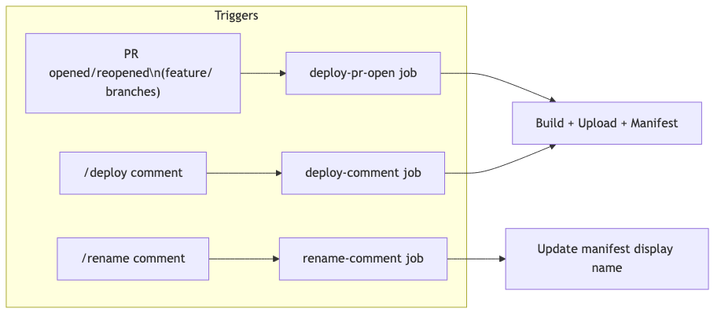
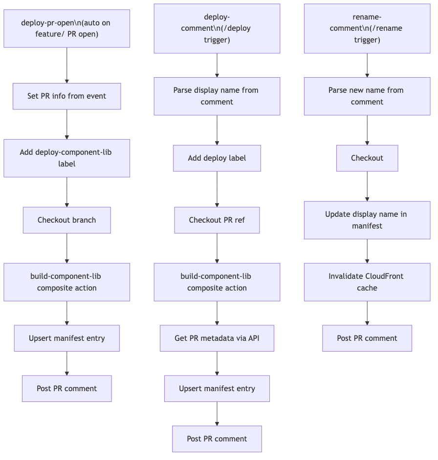
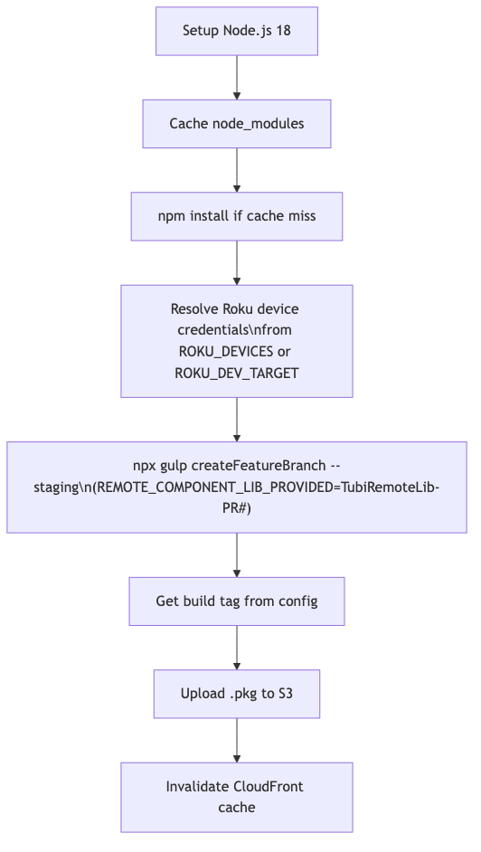
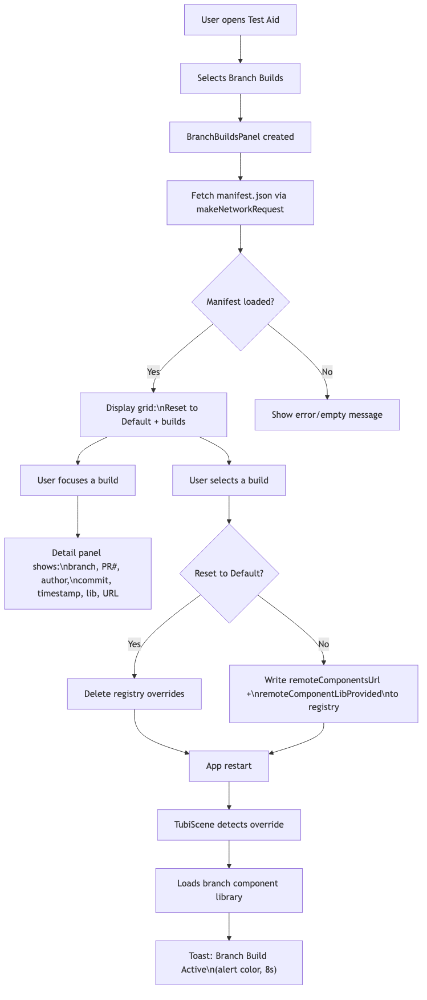

# Branch Component Library Deployment System

## Problem Statement

Currently, only one QA-branch package can be tested at a time. Feature branches require manual builds and device registry overrides. There is no way for QA to discover or select available branch builds from the device.

## Solution Overview

A CI-driven system that automatically deploys component library builds to S3 when a `feature/` PR is opened, or manually via a `/deploy` comment. An in-app Test Aid panel (Branch Builds) lets QA browse available builds and select one directly on the device. A toast notification alerts users when a branch build override is active.

## Architecture Flow

### Full System Overview



### Deployment Triggers



### CI Job Flow



### Composite Action: build-component-lib



### Test Aid UI Flow



## Manifest Schema

The manifest at `s3://tubi-roku-multi-cdn-source-staging-core/appFiles/components/branches/manifest.json`:

```json
[
  {
    "prNumber": 5861,
    "displayName": "Feature testing build improvements",
    "branch": "feature_testing_build_improvements",
    "commitSha": "8fa7e6e7afa2472a4cb5a6597bfa20fc5a9e3bb2",
    "author": "prajwalkshetty",
    "timestamp": "2026-03-03T20:20:45.563Z",
    "url": "https://mrcdn-staging.tubitv.com/appFiles/components/branches/5861/tubi_remote_components.pkg",
    "libProvided": "TubiRemoteLib-5861"
  }
]
```

## S3 Path Structure

```
appFiles/components/branches/
  manifest.json                          <- Index of all available builds
  5861/
    tubi_remote_components.pkg           <- PR #5861 build
  5862/
    tubi_remote_components.pkg           <- PR #5862 build
```

## Implementation Files

### CI Side

| File | Purpose |
|------|---------|
| `.github/workflows/deploy-component-lib.yml` | Workflow: auto-deploy on `feature/` PR open, `/deploy` comment trigger, `/rename` comment trigger |
| `.github/workflows/component-lib-cleanup.yml` | Weekly cleanup: removes S3 artifacts and manifest entries for merged PRs |
| `.github/actions/build-component-lib/action.yml` | Composite action: build, package, upload as workflow artifact (runs on `roku-pkg-runner`) |
| `.github/actions/upload-component-lib/action.yml` | Composite action: assume cross-account role, download artifact, upload to S3, invalidate CloudFront (runs on `staging` runner) |
| `.github/actions/update-manifest-and-notify/action.yml` | Composite action: update S3 manifest and post PR confirmation comment |
| `.github/scripts/manageBranchManifest.js` | S3 manifest CRUD script (upsert, remove, rename) |

### App Side

| File | Purpose |
|------|---------|
| `TestAid/BranchBuildsPanel.xml` | Branch Builds panel UI (extends ListPanel, grid + detail area) |
| `TestAid/BranchBuildsPanel.brs` | Fetches manifest, displays builds, shows detail on focus, writes registry on select |
| `TestAid/TestingAidPanel.xml` | "Branch Builds" menu item (below Experiments) |
| `TestAid/TestingAidPanel.brs` | Creates/shows BranchBuildsPanel, handles panel close and app restart |
| `ContentController/ContentController.brs` | Shows toast notification when branch build override is active |
| `TubiScene/TubiScene.brs` | Reads `configurationOverrides` registry, sets `m.global.remoteComponentLibraryOverridden` |
| `source/Constants.brs` | `reqNames.getBranchManifest` constant |
| `GeneralTask/ControllerGeneralTask.brs` | Registered `getBranchManifest` request type |

### Config Side

| File | Purpose |
|------|---------|
| `js/config.js` | `REMOTE_COMPONENT_LIB_PROVIDED` env var override for `remoteComponentLibProvided` |
| `gulpfile.js` | `createFeatureBranch` task (series of `buildRemote` + `packageRemote`) |

## CI Job Architecture

The deploy workflow splits work across two runner types:

```
┌─────────────────────────────┐     ┌─────────────────────────────┐
│   roku-pkg-runner           │     │   staging runner             │
│   (has Roku device)         │     │   (has AWS access via KIAM)  │
│                             │     │                              │
│  build-component-lib        │     │  upload-component-lib        │
│  ├─ npm install             │     │  ├─ Assume staging-core role │
│  ├─ Resolve Roku device     │ ──► │  ├─ Download pkg artifact    │
│  ├─ gulp createFeatureBranch│     │  ├─ Upload pkg to S3         │
│  └─ Upload artifact         │     │  ├─ Invalidate CloudFront   │
│                             │     │  ├─ Update manifest          │
│                             │     │  └─ Post PR comment          │
└─────────────────────────────┘     └─────────────────────────────┘
```

The split is required because:
- **Build** needs a physical Roku device for package signing (`roku-pkg-runner`)
- **Upload** needs AWS credentials for S3/CloudFront (`staging` runner with KIAM role assumption to `staging-core` account)

### Cross-Account AWS Access

The staging runner (account `370025973162`) assumes the `staging-core-arc-internal-system-runner` role in account `791595947314` using `aws-actions/configure-aws-credentials`. This is necessary because the S3 bucket and CloudFront distribution live in the staging-core account.

## Workflow Features

### Concurrency Control

Concurrent runs for the same PR are cancelled automatically:

```yaml
concurrency:
  group: deploy-component-lib-${{ github.event.issue.number || github.event.pull_request.number || github.ref_name }}
  cancel-in-progress: true
```

### Automatic Cleanup

The `component-lib-cleanup.yml` workflow runs weekly (Monday 6 AM UTC) and can also be triggered manually via `workflow_dispatch`. It:
1. Downloads the manifest from S3
2. Checks each PR's status via the GitHub API
3. For merged PRs: deletes S3 artifacts and removes the manifest entry
4. Invalidates the CloudFront cache

### Job Timeouts

All jobs have a 5-minute timeout to prevent hung runners.

### Scoped Permissions

Each job declares only the permissions it needs (e.g., `contents: read`, `pull-requests: write`) instead of broad workflow-level permissions.

## GitHub Setup Requirements

### Repository Variables (Settings > Secrets and variables > Actions > Variables)

| Variable | Value | Purpose |
|----------|-------|---------|
| `CDN_DISTRIBUTION_ID` | CloudFront distribution ID (e.g. `E1DIAJVA9IZ6OD`) | Cache invalidation after S3 uploads |
| `AWS_ROLE_ARN` | IAM role ARN in staging-core account | Cross-account S3/CloudFront access |

### Repository Secrets

| Secret | Purpose |
|--------|---------|
| `PKG_PASSWORD` | Roku package signing password |

## How to Use

### For Developers

1. Open a PR from a `feature/` branch -- CI auto-deploys and comments with build details
2. Or comment `/deploy` (or `/deploy My Custom Name`) on any PR to trigger a build
3. Comment `/rename New Display Name` to update the build's display name without rebuilding
4. The `deploy-component-lib` label is added automatically; remove it to prevent future auto-deploys
5. Stale builds are cleaned up automatically after PRs are merged (weekly cleanup)

### For QA

1. Open **Settings > Testing Aid** on the Roku device
2. Select **Branch Builds** (below Experiments)
3. Press right to focus the builds list
4. Navigate builds -- detail panel on the right shows branch, PR, author, commit, timestamp
5. Press OK to select a build -- app restarts with the selected component library
6. A red toast notification confirms the branch build is active
7. Select **Reset to Default** to return to the standard build

## Security

- All user-controlled inputs (comment body, PR title, issue title) are passed through environment variables, not inline `${{ }}` interpolation, to prevent GitHub Actions script injection on self-hosted runners
- Cross-account AWS access uses IAM role assumption (no long-lived access keys)
- Job-level permissions ensure each job only gets the GitHub token scopes it needs
- Registry overrides are only applied in non-production modes (checked in `TubiScene.brs`)
- CloudFront invalidation failures are non-blocking (`continue-on-error: true`)
