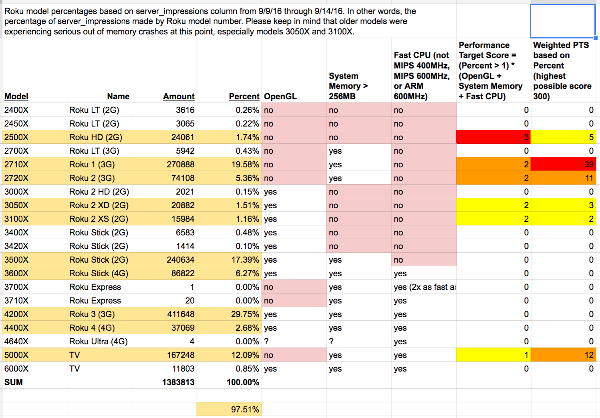

# Roku Performance - 11/2-11/4

====

## Step 1: Identifying our targets

### Roku Model Targets from Tubi Audience

Variables in grouping Roku devices:

- OpenGL vs. non-OpenGL
- 256MB vs. 512MB models
- slow CPU vs. fast CPU (dual cores)
- Display resolution (some old devices can do 1080p)
- VRAM available (mostly in-line with system RAM)

*Note that Percent for 256MB devices are about half of what they should be due to recent channel crashes. This doesn't ultimately change the Weighted PTS enough to affect the recommendations here.

### Target Device Recommendations

Final Roku Tuning Hardware Profiles, based on weighted PTS and grouping for similar hardware

#### PROFILE 1:  Roku 1/2 (2710/2720, high-mem, low CPU, no OpenGL)

#### PROFILE 2: Roku TV/Express (5000,37xx, high-mem, high-cpu, no OpenGL)

#### PROFILE 3 (SANITY CHECK):  Roku HD/2XD/2XS (256MB devices)

#### PROFILE 4: Everything else

====

# Step 2: Identifying weakness in each target

## PROFILE 1

**Target** Roku 1/2 (2710/2720, high-mem, low CPU, no OpenGL)

**Goal**
Smooth navigation while CPU and OpenGL acceleration are missing.

This is a very large customer segment at 25%, and legacy channel users who have certain performance expectations coming from the old experience.  They are probably used to slow poster loads and low graphics flair (note that Netflix uses SDK1 for these), but navigation is responsive.

## PROFILE 2

**Target** Roku TV/Express (5000,37xx, high-mem, high-cpu, no OpenGL)

**Goal**
Smooth navigation and visually pleasing UI on single-core CPU without OpenGL

This is likely a growing target segment, unlike the targets in PROFILE 1.  Roku-powered TVs are gaining popularity and the Express was just released in Oct 2016.  These will be new users with visual expectations that match the appeal of Netflix' modern UI.  Note that these are LESS performant than the old Roku 3.

## PROFILE 3 (SANITY CHECK)

**Target** Roku HD/2XD/2XS (256MB devices)

**Goal**
No crashes due to memory constraints, but not at the expense of CPU usage.

This segment is only about 5%, though dropped from 10% due to crashes with the old channel experience.  The channel must stay within memory constraints to keep these users, but there are few CPU cycles we can spare for lazy loading schemes.

====

====

# Step 3: Quantify UX Metrics and Prioritize

Decide which of these are important and which are malleable:

1. Time to first category grid populated
2. Delay in category posters visible after scroll across categories
3. Delay in category posters visible after scroll within a category
4. Total categories available (if limited)
5. Total items available within a category (if limited)
6. Time to content background load after selection

====

====

# Performance Baselines

1. Roku SDK 1 "Simple Grid" example - [simplegrid.zip](simplegrid.zip)
2. SceneGraph "Hero Grid" example - [hero-grid-channel.zip](hero-grid-channel.zip)
3. Amazon Video channel - SDK 1 on all devices with large content metadata (2164 on PROFILE1, 1862 on PROFILE3)
4. Netflix channel - Split, SDK 1 on PROFILE1 and PROFILE3, clunky SceneGraph on PROFILE2
5. Current TubiTV channel - SDK 1 with large content metadata sizes

====

====

# Roku Performance Observations

- Seems that Roku 3 and newer are OK devices to handle graphics and Brightscript "well"
- More than 3-4k brightscript/SceneGraph objects existing in one thread seems to affect execution time of SceneGraph, probably due to poor garbage collection performance
- native BRS objects take less physical RAM than SceneGraph components
- non-OpenGL devices are prevalent
- Running in SD is quicker to navigate than HD, at least for the Roku1 device I ran this on
- SceneGraph TubiContenNode takes around 25KB of memory for one item metadata, much less as roAssociativeArray (90% less?)
- roVideoPlayer in HD likes to have around 70MB of RAM for use in video buffering, otherwise it starts to run into crashing issues
- Posters exist in VRAM uncompressed, though may be scaled based on loadWidth and loadHeight being set in the code
- Even if display mode is set to SD, all UI over HDMI will be 720p and scaled down
- Converting ~40 pieces of content metadata to ContentNode takes roughly 2s on old CPUs, not accounting for network transfer time.  This consumes a lot of CPU time during grid navigation
- We have roughly 4300 total pieces of content (excluding episodes within a series) at about 35% redundancy across categories
- 256MB models have 39MB VRAM, while 512MB models have 63MB VRAM (Roku 3 has 70MB, Roku 4 has 100MB)
- Native components can handle dynamic loading, but callbacks are triggered on a per-item basis when using appendChild & friends.  Better to replace a whole row at a time with replaceChild() at the parent level.
- Be careful with many components referencing the same data model.  Modifying the children of a node will cause the node to trigger change listeners for the parent.  Better to duplicate the top-level content structure to be used internally by the component which is modifying it.
- Native components are fast to navigate since they stay out of brightscript, but are susceptible to CPU bottlecks on older single-core devices that have background activity, e.g. in Task threads.
- Using CreateObject for ContentNodes takes a rather large amount of time.  These can be pre-created on startup or before an HTTP response is received, to save response parsing time.
- Metadata conversion has many fields, some of which are not needed in all places.  There was a performance improvement on old devices to skip some fields.
- Custom SG components seem to suffer from callback jank if we use "has-a" instead of "is-a".  It seems to be better to have a flatter layout than to overuse composition.
- Also Custom SG components seem to have ambiguous "focus" issues when the node tree goes too deep. Listening to "focusedChild" causes all components in the chain to be triggered when something as simple as a GridItem focus box moves.

# TubiTV Channel variables

- Amount of content metadata stored locally in the device
- Image resolution sizes for posters, backgrounds, etc. in VRAM
- Image source sizes (PNG, JPG) for posters, backgrounds, etc. over the network
- Number of callbacks/listeners invoked in response to user navigation
- Preload vs. lazy-load of metadata
- Native grid/list components vs. our custom "ScrollingList" and "ContentGrid"

=========

# FINAL DECISION

Decided to do the old experience on old devices