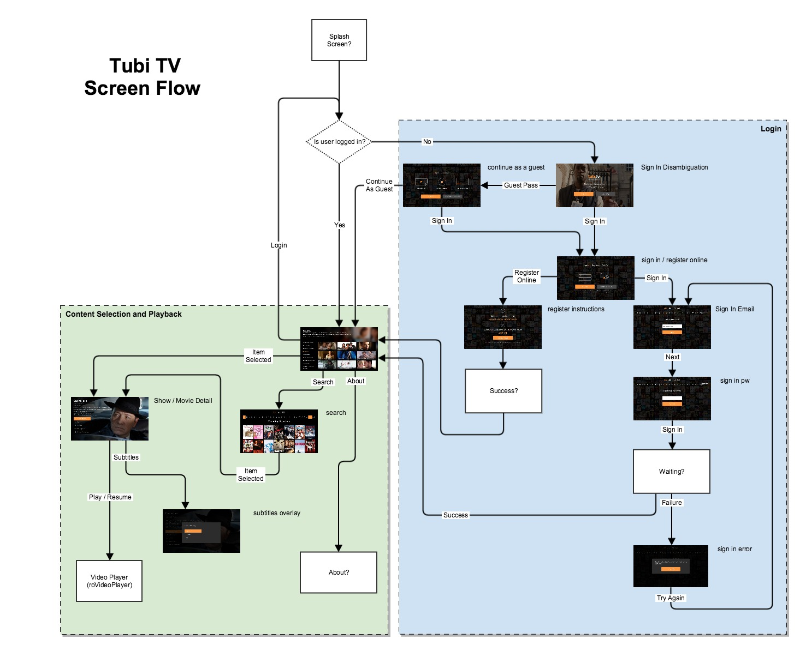
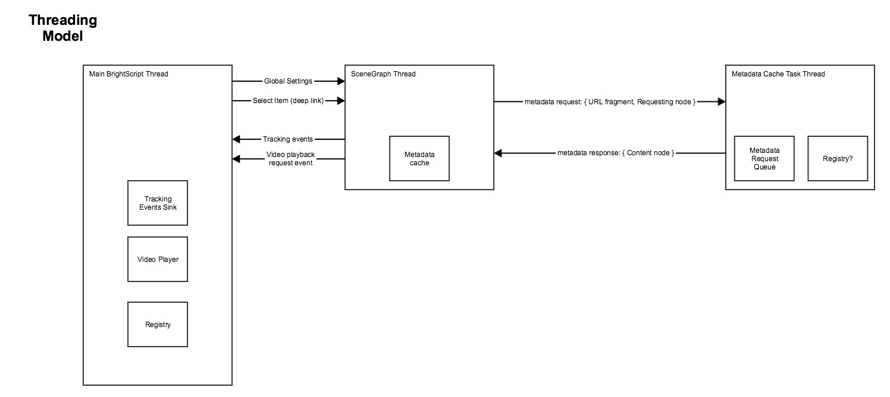
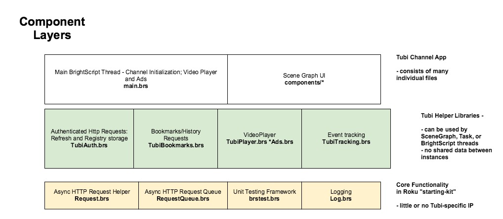

# Tubi TV Roku Channel Scene Graph Technical Design

This document outlines the requirements, tasks, and implementation strategy of the Tubi TV Roku channel redesign.

**Table of Contents**

* [Requirements](#requirements)
* [Technical Design](#technical-design)
* [Tasks & Milestones](#tasks--milestones)
* [Open Issues](#open-issues)
* [Reference](#reference-1)

=====

## Requirements

### Reference

* [RokuProjectHighLevelSpec.pdf](./RokuProjectHighLevelSpec.pdf)
* [roku_redline_HD_1280x720_no logo on top.pdf](roku_redline_HD_1280x720_no logo on top.pdf)
* [UI/UX Designs at Zeplin](https://app.zeplin.io/project.html#pid=574492a608d242320ea27b6b&dashboard)
* [Scope of Work](roku_channel_proposal_by_chris_thompson_for_tubi_tv.pdf)

### Feature Requirements from code reviews and discussions

1. ~~Makefile & support tools for generating manifests and configuration at build time~~ **DONE**
1. ~~Unit test framework~~ **DONE**
1. Hotpatches
1. Global Settings, including features affected by those settings (see default.yml)
				
        All settings are constant after the hotpatch, can be passed in to Scene Graph after hotpatching		
        Marios: “Settings that are not being used anymore should be removed”

				
1. Registry: storage & migration for credentials
				
        Keep registry migration intact for backward compatibility
		OLD: content ids, user information (userid/pass/first/last)
		NEW: auth token, datetime (?), refresh token
		Bryan: "The device registry was previously used to store user info (user id, password, first and last name), as well as content ids of videos that a user had watched. We need to keep the credential storage in tact as well as the code that migrates from the old credential system to the new credential system. We no longer need functionality that stores the content ids of videos that were watched."

1. Deep linking/launch

        Leads to details page or series list page

1. Target UI resolutions: 
	
		HD 720p with autoscaling for SD and other HD resolutions.

1. All Video & Ad playback in https://github.com/adRise/adrise_roku/blob/master/src/source/AdrisePlayer.brs
				
		Bryan will take care of this
		Needs refactor to use RequestQueue

1. Universal info message dialog (full screen, with ‘ok’ button)

		Marios: “The universal info message dialog could perhaps use a redesign? Lets worry about that later if possible though”

		Bryan: Bryan: "Universal message will almost certainly need a redesign. I believe there is a message component that we can use/customize. We may want to build a new one from scratch as well."

1. Global theme colors and other UI constants

		Items in getSettings() are constant after initialization

1. Metadata cache for UI

		Expecting many reqeusts (40-50) for category loading, we want to keep the Task thread count low and still have a responsive channel
				
1. User event tracking:

			Look in AdriseUtils.brs
			2 parts:
				trackEvents (ad completion events AND user events)
			Could be architected where SceneGraph and Main thread have their own separate outgoing queues for tracking events

## Technical Design

**Screen Flow**

**Threading Model**

**Component Layers**

**Hotpatching**

*Brightscript*: Brightscript thread can run Eval() on a downloaded .brs file 

*Scene Graph*: Scene graph XML and accompanying .brs files can be remotely loaded via the [ComponentLibrary](https://sdkdocs.roku.com/display/sdkdoc/ComponentLibrary) API.  

Note that common library files used by both the Brightscript thread and the Scene Graph thread will need to be hotpatched in both places.

**Registry and Token Updates**

We will have an HTTP request wrapper which a) attempts the request, b) on 401 looks in the registry for updated token, c) uses the refresh token to get a new JWT and persist it to the registry

**Global settings**

Global settings will be set on global AA by the main thread, then passed in to an interface field on the main Scene Graph Screen.  Global settings cannot contain function references, which will become Invalid across the thread boundary.

*NOTE: This won't work for components which are created in XML and need values at initialization time*

**Universal info message**

This needs to be available in SceneGraph thread, but must also be triggered by Main BS thread in case of an error during video or ad playback.  A field in the main Scene Graph controller will be observed and trigger the info message when written to.

**Metadata Cache**

Metadata cache will use a request queue in a long-lived Task thread.

Nodes will make a request for metadata by sending a tuple as input to the task node.  The requesting node will receive a response on a pre-defined interface field, probably "content" which would allow us to do conversion to Content node in the request thread and set directly on grid components.

Example code 

    =========
    TASK NODE
    =========
	<component id="MetadataRequestTask" extends="Task">
		<interface>
			<field id=“requestInput” type=“assocarray”>
		</interface>
    </component>
    =========
    REQUESTING NODE
    =========
	<component id="NeedMetadata" extends="Group">
		<interface>
			<field id=“content” type=“node”>
		</interface>
    </component>
    

**Deep Linking**

Deep Linking will occur by the primary SceneGraph controller exposing a field which transitions into the detail screen for a particular content id.  This field will be used by the controller internally when a user selects an item within the content screen, and also used by the Main Brightscript thread if channel launch arguments indicate deep linking.

Example code:

				SCENE GRAPH
				===========
				<component … extends="Scene">
					<interface>
						<field id=“itemSelected” type=“string”>
					</interface>
					
				</component>
				=====
				MAIN THREAD
				===========
				' after spawn scenograph
				if deep_link_id <> invalid
					scene.itemSelected = …

## Tasks & Milestones

UI work will be addressed by incrementally adding screens and functionality. The following order is recommended:

### Core Channel - Tubi agnostic
* HTTP Request wrapper
* HTTP Request Queue wrapper
* Logging abstraction

### Core Libraries - Tubi specific

* Registry management - JWT/refresh token management
* HTTP Request wrapper with JWT handling
* Metadata cache
* Hotpatching
* Event tracking: both main thread and scene graph thread

### Scene Graph Screens
* Prerequisites: theme common storage
* Main content screen
    * APIs: Category List and Category Metadata.
    * Custom components: main menu, main description, feature grid (16:9), poster grid (DVD), and hero background
    * Application Controller
* Detail Screen
	* APIs: Item Details, History, Queue, Episode List
	* Custom components: Label with progress, subtitles overlay, episode grid
* Video Player
* Search Screen
    * APIs: Search
    * Custom components: keyboard
* Sign In / Sign Up flow
    * APIs: Log in, Generate Code, Code Status
    * Screens: sign in disambiguation, continue as guest, sign in/register online, sign in email, sign in pw, sign in error
    * Sign In Controller
* Add History & Queue functionality
    * APIs: Get History/Recently Viewed, Get Queue/Bookmark, Set History/Recent, Set Queue/Bookmark
* Add Deep Linking
* About Screen
* Analytics/Events sweep
* Error Messages / Failure cases

## Open Issues

- Hotpatching of library functions won't work across the thread boundaries
- Global settings for Scene Graph need to be set before initializing the graph nodes, but ideally after being hotpatched
- Metadata cache needs to a method for communicating responses to the requesting node.

## Reference

* [github: Current Tubi TV Production Roku Channel](https://github.com/adRise/adrise_roku)
* [github: Scene Graph project](https://github.com/adRise/project-total-recall)
* [Old Roku channel screen flow](old_roku_screen_flow.jpg)
