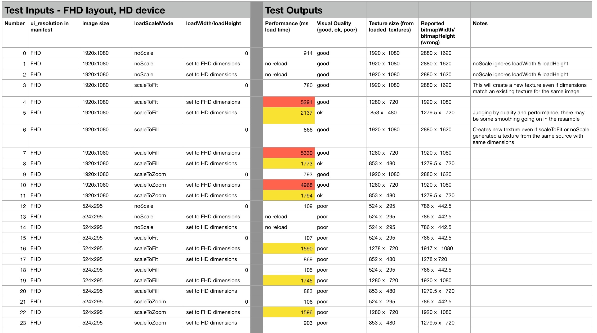

## Experiment
This is an experiemt to test the image quality, VRAM usage, and load performance of Poster nodes.

Tested on a 3500X stick with:

- `ui_resolutions=fhd`
- 1080p display output
- local images to avoid network transfer times

## Observations

- loadDisplayMode only affects images if loadWidth and loadHeight are also set
- load* runs some kind of smooth resampling on the image, even if the result dimensions are the same as the source
- load* processing time is affected by loadWidth/loadHeight about 4x more than by source image size
- bitmapWidth and bitmapHeight are always wrong when FHD layout is autoscaled
- loadWidth and loadHeight are adjusted by ui autoscale factor
- scaling *up* via loadWidth/loadHeight has same quality as if no load scaling were applied

## Takeaways

**Downscaling**: VRAM usage is significantly lower if loadWidth/loadHeight are set, but it only makes sense if downscaling to 25% or less in order to justify the performance hit.

**Upscaling**: don't set loadWidth/loadHeight since it only consumes more VRAM, quality is unchanged, and performance hit

**Exact Sizing**: don't set load* fields
